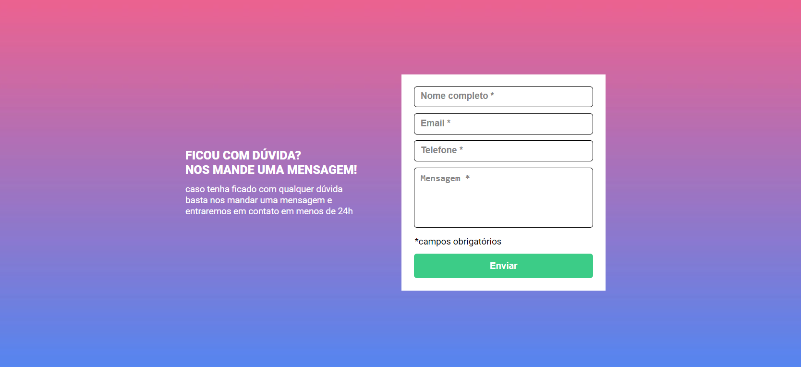

# Formulário com Validação ✅

## Descrição

Um formulário com validação em cada um dos inputs.

## Preview

 - Projeto inativo

 

 - Campos vazios

 

 - Campos preenchidos

 

## Observações

 - Estilização com hover nos inputs e botão.
 - HTML semântico.

# Tecnologias Utilizadas

 - HTML
 - CSS
 - JS